% La gestion de version avec GIT
%
% LTE Consulting

## Arnaud Tournier

**ArchiDév** passionné

Fondateur de **LTE Consulting**

Créateur de **POM Explorer**, **Angular2Boot**, etc.

Speaker **Java One**, **Devoxx**, **GWT.create**, **Paris**/**Toulouse JUG**, **GDG**, etc.

**Full stack** !

# Qu'est-ce que git ?

## Git

- Logiciel de **gestion de version distribué**.
- Un ensemble de **petits outils** pour manipuler un arbre d'objets.
- Créé par **Linus Torvalds**, pour les besoins du noyau Linux.
- Le développement commence en **2005**.
- Développement repris maintenant par **Scott Chacon**.
- Extrêment **rapide**, peut gérer de gros projets
- Tracke des **snapshots** et non des **différences**
- Assure la cohérence
- **http://git-scm.com**

## Git n'efface pas

Les données sont toujours **ajoutées** aux index

Donc une fois indexées, une modification ne sera **jamais** perdue

## La concurrence

Les systèmes centralisés : SVN, CVS, Perforce, ...

Les systèmes décentralisés : Mercurial, BitKeeper, ...

# Introduction en pratique

## Configuration

- git config -l

- git config --global user.name "Mon nom"
- git config --global user.email "mon.email@mail.un"
- git config --global color.ui true
- git config --global core.editor vim

. . .

On peut aussi configurer l'auto-complétion (sous Linux)

- contrib/completion/git-completion.bash à sourcer dans ~/.profile

## Aide ?

- git help
- git help commande

## Créer un repository

> - mkdir projet
> - cd projet
> - git init

## Les commandes de base

> - *éditer des fichiers...*
> - git add file1 file1 ...
> - git diff --cached
> - git status
> - git commit -m "Premier commit"
> - git log
> - git status

## On efface tout !

        cd ..
        rm -Rf projet


# Revenons à la théorie : le modèle objet

## Sha

Les SHA sont partout dans git !

40 caractères représentant la signature d'un contenu

        6ff87c4664981e4397625791c8ea3bbb5f2279a3

Il est **impossible** que deux contenus différents aient le même *SHA*

Ceci apporte certains avantages :

- comparaison d'objets rapide,
- les sha sont identiques sur les repos différents,
- détection des erreurs de cohérence.

## Les objets

Un **type**, une **taile** et un **contenu**

Il y a quatre types :

- **BLOB** : stockage d'un fichier
- **TREE** : référence des sous TREE et des BLOBS
- **COMMIT** : pointe vers un TREE et contient des métadonnées (auteur, date, commit(s) parents)
- **TAG** : utilisé pour tagger des commits

## Les blobs

<table>
<tr>
<td style="vertical-align:top;">
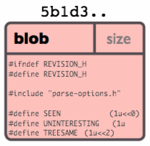
</td>
<td>
```bash
git show 6ff87c4664 # montre le contenu
git hash-object -w myfile.txt # crée un blob
```
- Deux contenus identiques partageront le même blob
- Invariant : `blob.nom == sha1(blob.contenu)`
- Indépendant de l'emplacement des données
</td>
</tr>
</table>

## Stockage

Le stockage des objets peu être **détendu** :

- Format ZIP dans un seul fichier (.git/objects/0a/ef6617772...)

Ou bien **packagé** :

- Stocke seulement les changements, et un pointeur vers le contenu similaire
- Calculé au moment d'un `git gc`
- Utilisé aussi pour les transfers inter-repo

## L'objet tree

<table>
<tr>
<td style="vertical-align:top;">
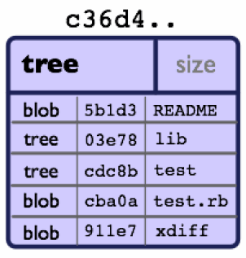
</td>
<td>
- C'est une liste de pointeurs vers des **blobs** et des **trees**
- Utilisé en général pour représenter un répertoire
- Deux trees n'ont le même nom que s'ils ont le même contenu, ceci facilite les recherches

```bash
git show # fonctionne mais il y a mieux !
git ls-tree fb3a8bdd0ce
100644 blob 63c918c66...2fdc80926e21c .gitignore
040000 tree 2fb783e47...6fea6013dc745 Documentation
100644 blob 6ff87c466...a3bbb5f2279a3 Makefile

cat /tmp/tree.txt | git mk-tree # création
5bac6559179...e2d8ae83
```
</td>
</tr>
</table>

## L'objet commit

<table>
<tr>
<td style="vertical-align:top;">
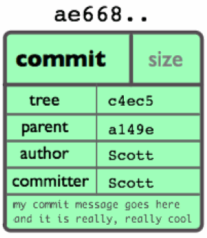
</td>
<td>
Créé avec la commande
      
      git commit
      
Pour explorer :

```bash       
git show HEAD --pretty=raw
commit fa7ed8...be930bbc0e
tree d0ae01...08b6457
parent 3ad3...32ee
author Arnaud Tournier...
committer Arnaud Tournier...
# comment...
```
</td>
</tr>
</table>

## Exemple de contenu

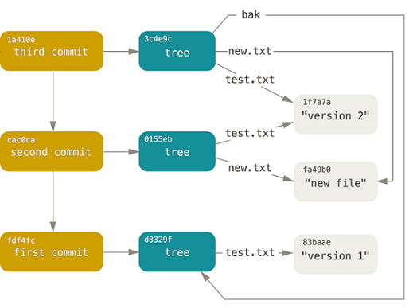

## L'objet tag

<table>
<tr>
<td style="vertical-align:top;">
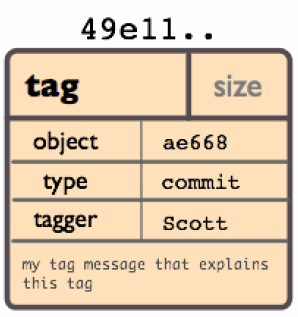
</td>
<td>
- Utilisés pour stocker des tags signés
- les tags légers sont stockés dans `refs/tags/`

Création avec 

```bash
git tag
```

Pour explorer :

```bash
git cat-file tag v2.1
object 8e26b5a...9de7193c2
type commit
tag v2.1
tagger Arnaud Tournier...
# comment...
```
</td>
</tr>
</table>

## Ramasse miettes

- git gc

Il est bon de le faire de temps en temps, mais attentions à ne pas perdre de "dandling commits" !!!

## Le répertoire .git

| Fichier | Rôle |
| ----- | ----- |
| HEAD | pointeur vers votre branche courante |
| config | configuration de vos préférences |
| description | description de votre projet |
| hooks/ | pre/post action hooks |
| index | fichier d'index |
| logs/ | un historique de votre branche |
| objects/ | vos objets (commits, trees, blobs, tags) |
| refs/ | pointeurs vers vos branches |

## Le répertoire de travail

- C'est votre espace de travail
- A la racine de votre projet
- Il est souvent modifié !

## Cycle de vie

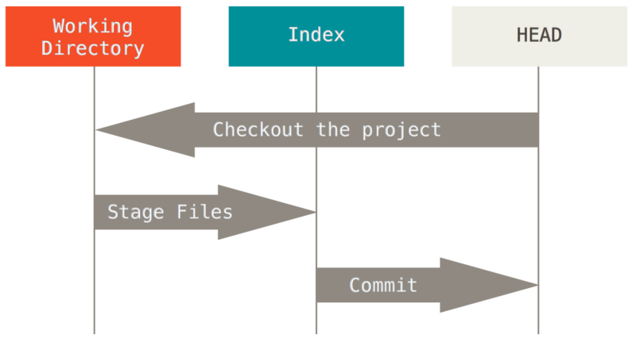

## Cycle de vie en détail


## L'index

- Fichier `.git/index`
- Zone d'assemblage pour construire un commit
- A la création d'un commit, ce n'est pas le répertoire de travail qui est pris en compte, mais cette zone dite de **staging**

Voici quelques commandes associées :

```bash
git add file
git rm file
git status
git commit
...
```

## Les branches

- Ce sont des pointeurs nommés sur des commits
- Stockées dans le répertoire `.git/refs/`
- La branche par défaut est **master**

Quelques commandes :

```bash
git branch branch_name
git checkout branch_name
```

## Illustration

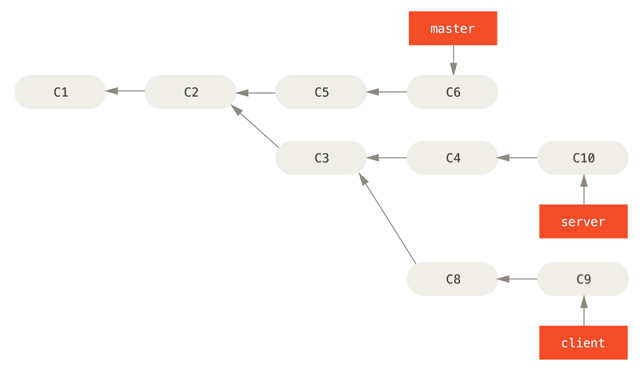

## Le pointeur HEAD

C'est un pointeur symbolique qui indique le **commit courant**.

Il est en général **égal à la branche courante**.

Mais pas forcément, c'est le mode **detached**.


# Utilisation locale

## Cloner un repo

Fonctionne avec les protocoles : fichiers, http, git, ssh, ...

        git clone git://server/path/projet.git

Vous êtes maintenant "branchés" sur le repository "central"

## Qu'a fait `git clone` ?

- Enregistre les coordonnées du dépôt distant,
- Rapatrie la branche `origin/master` ainsi que ses commits,
- Crée une branche `master` (locale) pointant sur le même commit que `origin/master`,
- Fait le checkout de la branche `master`

## Ajouter un fichier à l'index

        git add file1 file2 ...

        git diff --cached
        git status

## Etat du repository

> - Répertoire de travail : `git status`, `git diff`
> - Index : `git diff --cached`
> - Les deux : `git diff HEAD`
> - Seulement les stats : `git diff --stat`
> - Et ça ? `git diff HEAD -- ./lib`

## Effectuer un commit

        git commit -m "message"        
        git commit -a -m "message"

Modifier le commit précédent :

        git commit --amend

## Conseils pour un commit

- Faire des petits changements
- De nombreuses fois
- Message : une ligne de sujet, une ligne vide et une description

## Annuler une modification

        git checkout -- fichier

## Retirer un fichier de l'index

De l'index et du répertoire de travail

        git rm fichier
        
De l'index seulement
        
        git rm --cached fichier

## .gitignore

Par défaut, *git* surveille tous les fichiers de l'espace de travail.

Le fichier **.gitignore** permet de spécifier des patterns à ignorer, exemple :

        .settings/
        .project
        *.classpath
        /doc/[abc]*.txt
        *.iml
        gwt-gen/

## Git reset

Forme | Impact
----- | -----
git reset HEAD fichier | retire de l'index, ne touche pas au fichier
git reset | détruit la zone de staging (index)
git reset --hard | idem, mais touche aux fichiers de travail
git reset *commit* | repositionne la branche courante sur le commit
git reset --soft | ne touche ni à l'index, ni au fichiers de travail

## Utilisation des branches

> - git branch
> - git branch experience
> - git checkout experience
> - git checkout -b experience
> - git checkout master && git merge experience
> - git branch -d experience

## La fusion (merge)

Après avoir créé et travaillé sur une branche de développement, on souhaite la fusionner dans la branche principale

## Merge en images

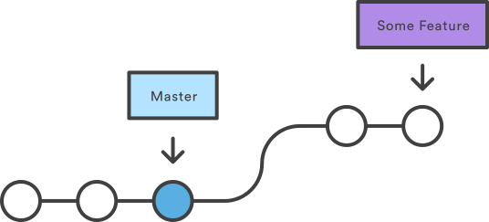

## Merge en images

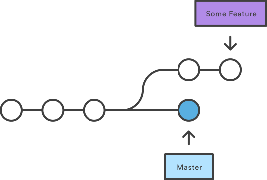

## Merge en images

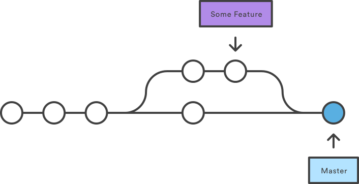

## Exemple

> Avoir un repo clean

> - git checkout -b dev
> - créer un fichier
> - git commit -a -m "dev 1"
> - git checkout master
> - git merge dev
> - git branch -d dev

## Les cas de merge

> - Pas de conflit, fast-forward (cas précédent)
> - Pas de conflit, mais il faut un commit de merge (la plupart des cas)
> - Conflits !

## Détection des conflits

Si un conflit apparaît, l'opération de merge s'arrête temporairement, et *git* indique directement dans les fichiers les endroits qui posent problèmes.
		
		<<<<<<< HEAD:file.txt
		Hello world
		=======
		Goodbye
		>>>>>>> 77976da35a11db4580b80ae27e8d65caf5208086:file.txt

## Résolution des conflits

A vous alors de résoudre le conflit. Il existe de nombreux outils disponibles...

Une fois le conflit résolu, faire :

        git add file.txt
        git commit

## Historique

> - git log
> - git log --since="2 weeks ago"
> - git log extract.sh
> - git log commons/
> - git log -S'foo()'
> - git log -p # pour voir les patchs
> - git log --stat
> - git log --pretty=oneline
> - git log --pretty=format:'%h was %an, %ar, message: %s'
> - git log --graph

## Ordonnancement de l'historique

- git log --pretty=format:'%h : %s' --topo-order --graph

		* 4a904d7 : Merge branch 'idx2'
		|\
		| * dfeffce : merged in bryces changes and fixed some testing issues
		| |\
		| | * 23f4ecf : Clarify how to get a full count out of Repo#commits
		| | * 9d6d250 : Appropriate time-zone test fix from halorgium

## Comparaison de commits

- git diff master..test

- git diff master...test


## Les raccourcis

## Sha partiel

Pour référencer un SHA, on utilise :

        980e3ccdaac54a0d4de358f3fe5d718027d96aae
        980e3ccdaac54a0d4
        980e3cc

## Pointeurs

Vous pouvez également utiliser toute branche, tag, etc... :

        980e3ccdaac54a0d4de358f3fe5d718027d96aae
        origin/master
        refs/remotes/origin/master
        master
        refs/heads/master
        v1.0
        refs/tags/v1.0
    
## Autres

        master@{1 month ago}
        master^2 # Deuxième parent
        master~3 # Troisième ancêtre
        master^^~ #idem

## Pointeur de tree
        
Pour obtenir le SHA du TREE vers lequel un COMMIT pointe, on fait :

        master^{tree}

## Blobs

Pour obtenir le SHA d'un blob :

        master:/chemin/fichier


## Rebase

Les commits de merge sont puissants mais ils compliquent aussi l'historique.

. . .

La commande **git rebase** vient à la rescousse ! Elle permet de réécrire l'historique.

## Rebase en image


## Rebase en image

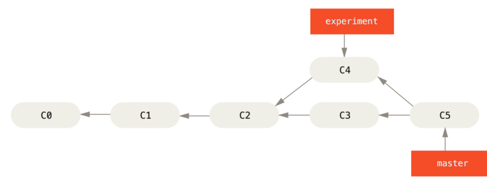

## Rebase en image


*Notez bien que C4' est différent de C4 !*

## Rebase en image


## Rebase local

        git checkout experiment
        git rebase master
        
Rebase la branche **developpement** sur la branche **master**.

## Conflits

Il peut y avoir des conflits.

Dans ce cas comme pour un merge, l'utilisateur résout et :

        git rebase --continue
        git rebase --abort # pour annuler

## Rebase intéractif

Permet réécrire très facilement vos commits. C'est très pratique et très puissant pour le travail collaboratif.

        git rebase -i
        
Ouvre un éditeur de texte contenant ceci :

        pick fc62e55 added file_size
        pick 9824bf4 fixed little thing
        pick 21d80a5 added number to log
        
Les trois commandes disponibles sont : **pick**, **squash**, **edit**

## Rebase intéractif - edit

Git vous redonne la main, ce qui permet par exemple de couper un commit en deux.

        git add fichier1
        git commit -m "tache A"
        git add fichier2
        git commit -m "tache B"
        git rebase --continue

## Les tags

Un label qui pointe sur un commit

- git tag v2.3.4b 1b238ae12

## Les tag objets

- git tag -a v2.3.4b 1b238ae12

`-s` pour signer le tag, après avoir configuré la clé utilisateur

- git config --global user.signingkey `<gpg-key-id>`


# Collaboration

## Principe

Git est **distribué**.

Il fournit des outils pour **synchroniser** des repositories distants.

Un repo *local* n'est pas différent d'un repo *distant*, il contiennent tous les deux toutes les informations.

## Configuration d'un dépôt public

C'est un repository sans zone de travail (*bare*)

## Avec le protocole **git**

A partir d'un repo local, avec le protocole **git** :

- git clone **--bare** src_folder dest_folder
- touch dest_folder/.git/git-daemon-export-ok

> Ensuite, lancer le démon git

- git daemon  

## Avec le protocole **http**

Avec le protocole **http** :

- git clone **--bare** src_folder dest_folder
- git --bare update-server-info
- chmod a+x hooks/post-update

> Les autres peuvent cloner comme ceci :

- git clone http://adresse/projet.git

## Avec le protocole **ssh**

- git clone **--bare** src_folder dest_folder

> Les autres peuvent cloner comme ceci :

- git clone user@server:chemin/projet.git

## Git clone

- Enregistre les coordonnées du dépôt distant,
- Rapatrie la branche `origin/master` ainsi que ses commits,
- Crée une branche `master` (locale) pointant sur le même commit que `origin/master`,
- Fait le checkout de la branche `master`

## Travailler avec des repos distants

Liste des repos distants :

        git remote

Ajouter et retirer :

        git remote add origin http://...
        git remote rm origin

## Fetch

Ramène les commits et les branches distants :

        git fetch <remote>
        git fetch <remote> <branch>

Cette commande n'a aucune incidence sur votre travail **local**. Mais maintenant votre repo est à jour des informations contenues dans le repo distant.

## Les branches distantes

- contenues dans `refs/remotes/origin/...`
- faire un `checkout` sur un branche distante nous place en état **detached**, mais permet la revue avant intégration.
- pour fusionner les changements il suffit de faire un `git merge origin/master`

## Pull

Le deux étapes précédentes sont si courantes qu'il existe une commande intégrée : **git pull**.

        git pull <remote>
        
        git pull --rebase <remote>

## Rebase avec un repo distant

```bash
git rebase
git pull --rebase
```

- **détruit** les commits locaux
- **synchronise** les commits de origin
- **rejoue** les commits locaux

## Push

Envoi du travail local vers un repo distant

        git push <remote> <branch>

Git distant refusera si les commits ne sont pas "*fast-forward*"

        git push --force # ATTENTION !

Par défaut les tags ne sont pas transférés :

        git push --tags

## Exemple

        git checkout master
        git fetch origin master
        git rebase -i origin/master
        # Squash commits, fix up commit messages etc.
        git push origin master

## Branche de suivi

Une branche peut être configurée pour suivre automatiquement une branche distante lors des `git pull` et `git push` :

        git branch --track exp origin/exp` 

A noter : `git clone` fait ceci automatiquement sur la branche `master`


# Workflows

## Git s'adapte

Un des gros avantages de Git est de vous permettre d'adapter son utilisation à **votre** workflow, et pas l'inverse.

Une foule de *workflow* différents existent, voici quelques exemples...

## Le partagé


## L'intégration


## Le dictateur


## Git Flow

C'est une façon de fonctionner avec *git*.

On utilise 5 sortes de branches

> - branche de **développement**
> - branches de **features**
> - branches de **release**
> - branche **master**
> - branches de **hotfix**

## Début d'une feature

Création d'une branche de **feature** basée sur la branche de développement


## Fin de la feature

Fusion de la branche **feature** dans la branche **développement** (*--no-ff*), effacement de la branche **feature**


## Commencer une release

Création de la branche de **release** à partir de la branche **développement**


## Terminer une release

Merge la branche de **release** dans **developpement** et **master**, Taggue la branche **master** et détruit **release**


## Commencer un Hotfix

Création de la branche de **hotfix** à partir de la branche **master**


## Terminer un hotfix

La branche **hotfix** est fusionnée dans **master** et **développement**. La branche master est tagguée avec le numéro de hotfix.


# Utilisation avancée

## Le Stash

Afin de pouvoir rapidement sortir de l'état courant pour aller sur une autre branche, le **stash** sauvegarde le travail en cours

        git stash save "en cours tache C"
    
L'index est maintenant vide, le répertoire de travail est propre. Pour revenir :

        git stash apply

## La file de stash

Pour montrer la file des stashs :

        git stash list
        
        stash@{0}: WIP on book: 51bea1d... fixed images
        stash@{1}: WIP on master: 9705ae6... changed the browse code

Pour appliquer un stash :

        git stash apply stash@{1}

Pour vider la liste :

        git stash clear

## Créer un commit d'annulation

Git permet de créer un commit mirroir d'un autre commit :

        git revert SHA

Bien sûr des conflits peuvent se produire...

## Le Cherry-Pick

Il vous permet de **reproduire un commit** à un autre endroit, en le dupliquant.

        git cherry-pick SHA

Pour résoudre les éventuels conflits :

        git cherry-pick --continue
        git cherry-pick --abort

## Déplacer un fichier

        git mv fichier nouveau_fichier

est équivalent à

        mv fichier nouveau_fichier
        git rm fichier
        git add nouveau_fichier

## Blame

Permet de voir l'auteur de chaque ligne d'un fichier :

        git blame index.html --date short
        ...
        96776a42 (Gregg 2012-06-29 9) <ul>
        96776a42 (Gregg 2012-06-29 10) <li>Cats</li>
        3ea7f709 (Jane 2012-06-30 11) <li>Octopi</li>
        96776a42 (Gregg 2012-06-29 12) </ul>

## Alias

Permet de rajouter des commandes à git :

        git config --global alias.mylog \
            "log --pretty=format:'%h %s [%an]' --graph"
            
Donnera :

        git mylog
        * 19f735c Merge branch 'admin' [Jane]
        |\
        | * 7980856 Add user admin [Jane]

## Bisect

Aide la recherche du commit fautif...

        git bisect start
        git bisect good v2.6.18
        git bisect bad master

Puis

        git bisect bad
          ... ou ...
        git bisect good
        
        git bisect reset

## Reflog

Git tient un journal de bord de **HEAD**. Il permet par exemple de retrouver des commits non-référencés.

        git reflog
        
        ad8621a HEAD@{0}: reset: moving to HEAD~3
        298eb9f HEAD@{1}: commit: Some other commit message
        bbe9012 HEAD@{2}: commit: Continue the feature
        9cb79fa HEAD@{3}: commit: Start a new feature
        
        ... et donc ...
        
        git checkout HEAD@{1}

## Retrouver un commit

Si par mégarde vous perdez un (ou plusieurs) commit, vous pouvez toujours chercher les "dandling" commits avec cette commande :

        git fsck −−lost-found

Vous rapatrierez ensuite ceci avec *git checkout*, *git rebase*, *git cherry-pick*, ...

## Rechercher dans les commits

        git grep chaine
        
        -n pour les numéros de ligne

## Les Hooks

Afin de faciliter son intégration avec les usines logicielles, Git propose des *hooks*.

Ce sont des scripts exécutés à différents moments du cycle de vie, ils sont stockés dans `.git/hooks/`.

Vous pouvez les utiliser pour déclencher des opérations particulières.

## Utilité des hooks

Typiquement ils peuvent servir :

- à vérifier les messages de commit,
- envoyer des informations à la gestion de projet,
- workflow d'intégration continue (déclenchement de build)...

## Les hooks client

Hook | Utilisation
---- | ----
pre-commit | Vérification avant commit
prepare-commit-msg | Préparation du message de commit
commit-msg | Traitement du message utilisateur
post-commit | Action après commit (email, CI, ...)
post-checkout | Après checkout
pre-rebase | Avant un rebase

En général, si le hook retourne <> 0, l'action est abandonnée

## Les hooks serveur

Hook | Utilisation
---- | ----
pre-receive | Avant le push
update | Idem, mais une fois par ref poussée
post-receive | Après un push réussi

## Créer une branche vide

		git symbolic-ref HEAD refs/heads/nouvellebranche
		rm .git/index
		git clean -fdx
		<travailler>
		git add vos fichiers
		git commit -m 'Premier commit'


# Ecosystème

## GUIs

- gitk (par défaut)
- SourceTree
- TigGit (console)
- SmartGit

## Autour de Git

- gitosis
- gerrit
- gitblit
- git-flow
- ...

# Références

## Quelques sites...

https://git-scm.com

https://www.atlassian.com/git/tutorials/

http://gitimmersion.com/

# Merci !!!

## Questions ?

http://www.lteconsulting.fr